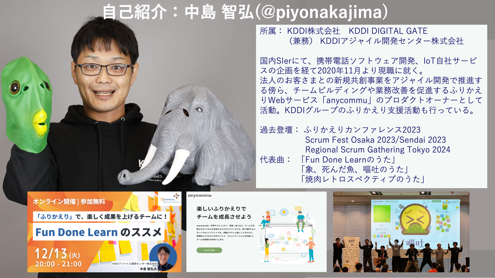
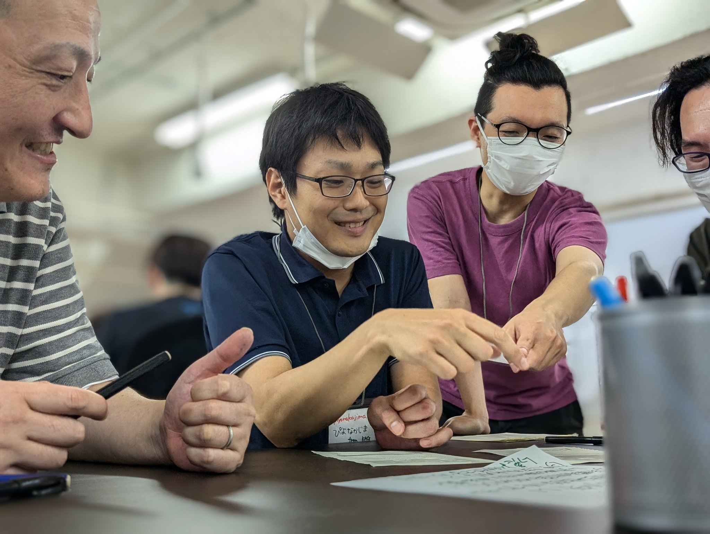
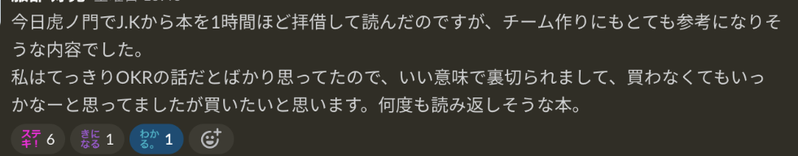
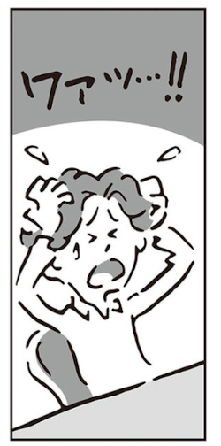
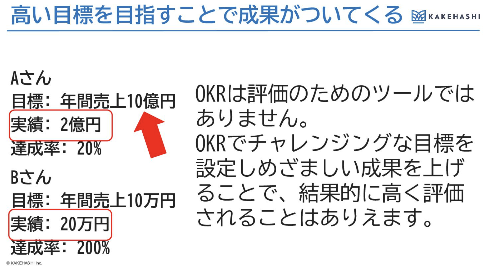
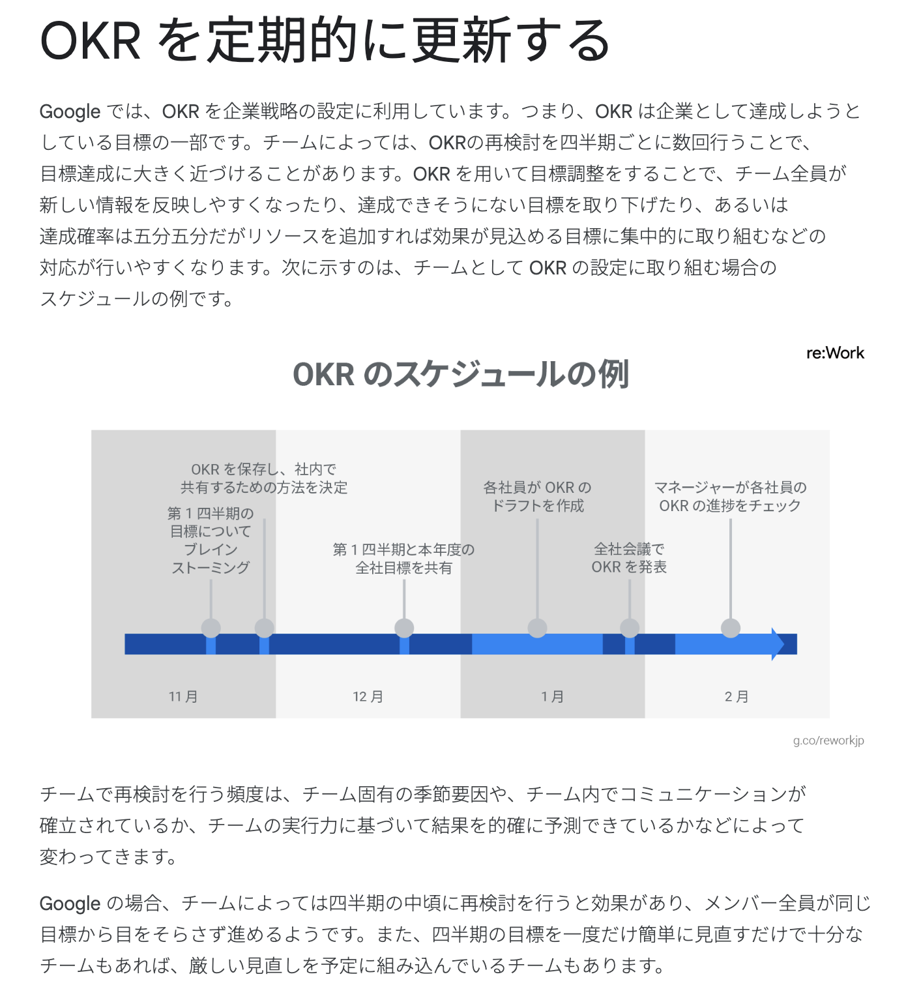
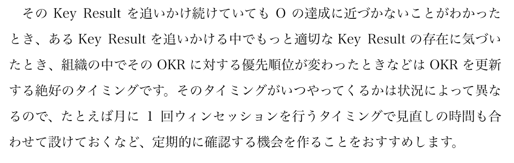

<!-- _class: top -->

## 2024.8.1

# 「アジャイルチームによる
#  目標づくりガイドブック」を読んで

### 開発１部　中島智弘(@piyonakajima)

---

<!-- 自己紹介　-->

---

# Agenda
- 全体の感想
- モヤモヤしている点
- 印象に残ったベスト３
- 読書後のTry

---

# 小田中育生ファン
- 小田中育生さんの話が聞けるなら行こうと思って行ったクリエーションラインのABDイベント
- 小田中育生さん撮影の写真がこれ

---
<!-- _class: crosshead -->

# みなさん読みました？

---

<!-- _class: crosshead -->

# 私は昨日読み終わりました😉

---

<!-- _class: crosshead -->

# 感想

---

<!-- _class: crosshead -->

# 目標の話以外のことめっちゃ多い😳

---
# 同じチームの方の感想
#
#
#
#
#
#
# すごい同感☺️

---
<!-- _class: crosshead -->

# というか
# いくおさんが登壇されていた内容だ

---

# 目次

- STEP1　お互いを知ろう
- STEP2　**ワクワクする目標をつくろう**
- STEP3　チームのリズムをつくろう
- STEP4　チームのマインドを育てよう
- STEP5　**助け合えるチームになろう**
- STEP6　チームの開発生産性を測ろう
- STEP7　チームの外と向き合おう
- STEP8　**ゴールにたどり着いたその先に**

全体的にOKRはちょこちょこ出てくるが、ほとんどがチームビルディングな話

---

# 何故目標設定の本でチームビルディングの話ばかり出てくる？

>お互いの価値観を知らずに自分の価値観で相手の行動・判断を評価してしまうと、価値観の違いからコミュニケーションがすれ違ってしまったり、場合によっては感情的に衝突してしまう恐れがあります。 　逆に、お互いの価値観や得意分野を理解し合っていると、共通の目標を追いかけるときに相乗効果を生み出しやすくなります。一人では達成できない目標が、背中を預け合えるチームメイトとなら達成することができます。
>
>

---

<!-- _class: crosshead -->

# 俺はいきいきいくおさんの本を読んだぜ！
# 俺がKAGの正しいOKRの作り方教えてやるぜ！

---

<!-- _class: crosshead -->

# そうはならなかった

---

<!-- _class: crosshead -->

# モヤモヤが３つあります

---
# モヤモヤしているポイント１

- 割愛

---

# OKRは評価のために使わないけど、OKRで追いかけた成果は評価としてみられる理解

#
#

#
#
#
#
#
#

- https://speakerdeck.com/kakehashi/do-you-like-target-management?slide=58

---
# モヤモヤしているポイント２
- 割愛

---
# モヤモヤしているポイント２
  - 配属先、支援先、さらにその先の顧客も**目標設定**がある
    - 自分の場合
      - 本務
      - 兼務
      - 支援先

  - KRを３つの部署で作る→３倍になる... **認知負荷！！**
  - **気持ち的には支援先のKRを全てのOと本務/支援先のKRに紐づけて追いかけたい**

---
# モヤモヤしているポイント３

 - 目標の見直しっていつやるの？

---
# モヤモヤしているポイント３
 - 目標の見直しっていつやるの？
#
#
#
#
#
##
#
#
#

---
# モヤモヤしているポイント３
 - （割愛）

---

<!-- _class: crosshead -->

# 印象に残った点

---

# ３位：リフレーミング

>みなさんの身の回りに何を相談しても「いいですね」「そういうこともありますよね」と否定せずに受け止め、「こういうことをやってみたらどうですか？」と前向きに提案してくる人はいないでしょうか。その人は肯定的意図を捉え、リフレーミングすることが習慣化している人なのかもしれません。肯定的意図を捉えるためには、自分の価値観ではなく相手の価値観、感情に寄り添っていく必要があります。

# （XX）さん！！！！いつもありがとうございます

---

# ２位：情報の非対称性

>難しいのが、情報の非対称性は決して悪意から生まれるものではない、という点です。「忙しそうだから、こっちで情報をまとめておこう」「エンジニアは開発に専念してほしいから、目標設定だったりチーム外との調整だったりはこっちで巻き取っておこう」「ちょっと進捗遅れがちだけど、マネージャーを不安にさせたくないから気合と根性でカバーしよう」「ビジネスサイドの動きは自分たちには関係がないから知らなくてよい」などなど、相手を思いやる善意や、相手がその情報を必要だと認識していない状況から情報の非対称性が生まれてしまいます。自分の想像で相手を忙しいと考え、知らず知らずのうちに情報の非対称性を生み出していないか、一度立ち止まって考えてみましょう。

# 俺これよくやるかも！！悪意ないのよ...

---

# そして１位は！？

---
# １位：小笠原さんのコラム

>自分としては頑張って挑戦して成長を感じているが評価されなかった、という経験を多く積んでしまうことで、学習性無力感を覚えて、成長する意欲を失ってしまうこともあるでしょう。 　ここで大切になるのは、他者の評価に左右されるのではなく自律することです。人は様々な経験を通じて、学びを深め成長していきます。その内容はとても複雑なので、評価という枠には当てはまらないものもありますが、確実に自分の中で育っています。自分はどんなことがしたいのか、自分の人生をどのように過ごしたいのか、というような自分のありたい姿を考えながら、そこに向かえるように、自律的に成長していきましょう。

# 本屋で立読みしたら涙腺緩み物理&電子購入

---
# 読書後のTry

- 業務：最初のインタビューを終えてこれから次のアクションを考えようとしている
- （会社のOKRは大切にしつつ）まずは今作ろうとしているプロダクトのOKRを考えようと思う

---

# チームに相談していないOKR案
# O: xxx(割愛)
## K1: xxx(割愛)
## K2: xxx(割愛)
## K3: xxx(割愛)

### うわーしんど…　これでいいの感

---

# 小笠原さん
>自分はどんなことがしたいのか、自分の人生をどのように過ごしたいのか、というような自分のありたい姿を考えながら、そこに向かえるように、自律的に成長していきましょう。

# 自分の人生のOKRを考えても良いかも
---

# 自分のOKR案
# O:自分の共感による創作活動を通して自分と自分と関わる人の人生を豊かにする
## K1:仕事プライベート問わず、「俺これ作った」と胸を張って言えるものを年内に10個作る
## K2:10000人以上の人が視聴閲覧するコンテンツを５つ作る
## K3:自分の作品に心を動かされた人の行動が内発的動機によって変容し自分にとって忘れられない思い出になる出来事を１つ以上生み出す

### ちょっとワクワクするかも。これ、あってる？

---

# 結論：OKRまだ全然わからん

- 読み返しながら実践していくつもり

# でも自分が「ワクワクするか？」はわかるはず

> 私は目標設定の力を信じています。ワクワクした目標を設定することでチームがいきいきとする。いきいきとしたチームがワクワクと目標に向かい続けることでグングン成長し、周囲が、そして自分達が驚くような成果を上げていく。目標設定を起点にして成長しながら目覚ましい成果を上げていく。そんなチームが増えて行ったら、もっと素敵なサービス・プロダクトが世の中に登場してくる。そうしたら世の中がもっとハッピーになっていく。そんな風になったらいいなと思ったのが、本書を執筆するに至った動機です。

---
<!-- _class: end -->
