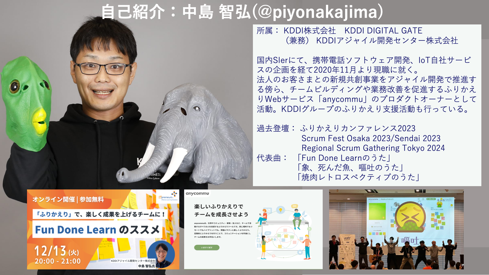

<!-- _class: top -->

#

#

#

#

## Scrum Fest Osaka 2024 沖縄トラック

# ぶっちゃけて話すための場作り

### 〜楽しくなかった Fun Done Learn と象死んだ魚嘔吐ジャーニー〜

### KDDI アジャイル開発センター 中島智弘

---

<!-- 自己紹介　-->

---

# 沖縄と私

- 20 年以上前修学旅行で行きました
- 海ぶどうとゴーヤチャンプルが大好きです

---

# 最終日勢いで出した proposal

- 書いた後 Draft に引っ込めた
- 沖縄の皆様に採択頂きました
- 再度公開

---

# 弊社広報の X

- 副題よくなかったかな…
- ~~昨日タイトル変えました~~
- やっぱり戻しました

---

<!-- _class: crosshead -->

# ここから本題

---

# ぶっちゃけていえていますか？

---

# ぶっちゃけていえていますか？義務ですよ？

---

# 本日のセッション

### Learning Outcome

- チームで **_ぶっちゃけて話あえる_** ようになる
- ぶっちゃけられるふりかえり手法「象、死んだ魚、嘔吐」を組織に合わせて実施できる

### Target Audience

- チームでぶっちゃけて話ができていないと思う人

---

# Agenda

- Fun Done Learn と私
  - Fun Done Learn が辛かった時の個人的な体験
  - Fun Done Learn が辛くなくなった時の個人的な体験
- 象、死んだ魚、嘔吐とは
  - 「象、死んだ魚、嘔吐」をやってみたかったけど怖くてできなかった個人的な体験
  - 「象、死んだ魚、嘔吐」をコミュニティでやってみたら勇気がもらえた個人的な体験
  - 「象、死んだ魚、嘔吐」を組織内外に広めた個人的な体験
- ぶっちゃけて話をするために必要なものって何なのか？

---

<!-- _class: crosshead -->

# Fun Done Learn と私

---

<!-- Fun Done Learn とは -->

# Fun Done Learn とは

- 2018 年沖縄にて日本のアジャイルコーチ達によって考案されたふりかえり手法

- おきた出来事を「楽しかったこと」「終わったこと」「学んだこと」に対話を通して分類する

- チームが置かれている状況を楽しく簡単に把握できる

---

<!-- なぜ曲を作った -->

---

<!-- _class: crosshead -->

# Fun Done Learn との出会い

---

# Fun Done Learn との出会い

- 2018 年スクラムと出会う ふりかえり＝ KPT だと思っていた

- 2020 年 KDDI に入社

- KDDI の中途入社の最終面接 「**_KDDI DIGITAL GATE_** という組織で働かないか？」

---

# FunDoneLearn との出会い

## 知らなかったので調べた

## Fukabori.fm で中の人が話をしていた

- KDDI DIGITAL GATE という DX 支援組織
- Fun Done Learn で毎日ふりかえり
- やっとむさんの Qiita 記事を読む
- ふりかえりをうまくまわせなかった自分
  - 単純におもしろそうと思った

## **_こうして入社を決意_**

---

# 入社後初めて見た

# Fun Done Learn

- **こんなに前向きに楽しくふりかえっていいの**
- 衝撃だった

---

<!-- _class: crosshead -->

# Fun Done Learn がつらかった時の個人的な体験

---

# 初めて Fun Done Learn をやった時の私

- 私がスクラムチームに入り Fun Done Learn を実践し始めた
- 転職直後は何もわからない

## 
何をやっているかまだわからない

## 
・・・。

と、ふせんに書いたら、沈黙が訪れた。

## 間違ったこと言った・・・！？

---

# 恐ろしい Fun Done Learn の始まり

## 「キャリア採用の人間が舐めたこと言った！？新人じゃないのに！！」

- 楽しいことだけを書かなければならない！！
- 頑張って前向きな言葉に変換するように頑張った
  - 「まだわからない」→「いやわかったこともあったよな」→「xx がわかった」
  - 私自身正直な意見を言いにくくなっていた
  - 「わからない」が言えなかったことがだんだん苦しくなってきた

---

# こちら、幸福安心委員会です。 /うたた P(2012)

- 2012 年に流行した VOCALOID の曲

## 
幸福なのは義務なんです。幸せですか？義務ですよ？

- 楽しいことしか書けないと察した私の心境
  - （今思うと）まるで幸福安心委員会だった

##  
決して苦しいことは誰にも悟られてはいけない！

- そう本気で（無意識で）考えていた
- この曲が昔流行した＝自分のような体験をした人は他にもいるはず

---

<!-- _class: crosshead -->

# Fun Done Learn が

# つらくなくなった個人的な体験

---

# ぶっちゃけて話せるようになった Fun Done Learn とその理由

## 業務が終わり雑談をしていたある日、会話の流れ。

## 
…で、結局ぴよさんはどうしたいの？
 

##  
…ふりかえりで言いたいことがいえない、この状況がつらいです

同じように沈黙は流れた。でもその場にいた全員が最後まで話を聞いてくれた
それをきっかけに少しずつオープンなコミュニケーションができるようになった

---

# その後の私とふりかえり

- 「わからない」と言って良い。ネガティブなことも言って良い
- 何がわからなかったかを話しすれば良い
- その会話でわかったら Fun に皆で置く
- それでもわからなければ Learn に置く
- いや、別にどこにも置かなくても良いし、結果どこに置かれても良い
- 対話を通してお互いを知ることに価値がある

---

# ぶっちゃけて話せるようになった後

## 見たこと感じたことを共有した

## そしてそれをチームのメンバーが受け止めた

## そうすると、その問題をどうするか話し合うことができた

## Try を出さなくても自然とカイゼンに向けた行動を取っていた

- 私がこの状態に辿り着くまでおよそ 3 ヶ月かかった

## ぶっちゃけて話すことは難しい　その場を作るのには全員の「勇気」が必要

---

# 川口恭伸さんはこう言っていた

> 「Fun! Done! Learn!」の手法を私自身が実践してみると、数々の気付きが得られます。とくに、「事実」が明確に集約される点は、この手法の利点として挙げられます。従来的なふりかえり手法で挙げられる「これが足りない」「こうした方がいいだろう」といった意見や要望は、実は具体的な根拠に基づいていない仮説でしかありません。しかし、「楽しかったこと」「完了したこと」「学んだこと」はすべて具体的な事実です。この方法により、毎回の反省点をよりポジティブに捉え、現実的な改善点を探り、継続的な改善活動を容易に実施できるのです。
> https://agilejourney.uzabase.com/entry/2023/10/19/103000
> (「引き継ぎできない！」から始まった私のスクラム - 川口恭伸の「はじめてのアジャイル」)

---

<!-- ふりかえりの目的 -->

---

# Fun Done Learn の課題点？

- エンジニアとして関わる中で Fun Done Learn のうたを作ってコミュニティで発表することになった

- Fun Done Learn をしらないアジャイル実践者は意外と多かった
- Fun Done Learn を社内外（特に社内）に啓蒙する活動を始めた
  - Fun Done Learn の 課題 「Problem（問題点） を言いにくい」
    - そんなことないはずなんだけど…（でも自分も言いにくかったな）

---

<!-- _class: crosshead -->

# 象、死んだ魚、嘔吐との出会い

---

# 象死んだ魚嘔吐との出会い

## Scrum Fest Fukuoka 2023 の懇親会にて小田中育生さんに会う

## 
象、死んだ魚、嘔吐の曲つくりましょうよ！
いくおさん

## 
象゛〜〜！！！！
いくおさん

## え　なにそれ　怖い

---

# 象、死んだ魚、嘔吐とは

## Airbnb ジョーゲビア氏が提唱したふりかえり

> ①「象」は口に出さないけれど全員が知っている真実。
> ②「死んだ魚」は、早くごめんなさいをしたほうがいい悩みのタネ。ほっておくと事態が悪化する。
> ③「嘔吐」は、人々が断罪されずに胸の内を話すこと。つまり「ぶっちゃけ」。

##  
これやったほうがよい！！！！

## 「前向きにならなきゃいけない」と思っている人はその事を言い出せない（実体験）

---

<!-- _class: crosshead -->

# 「象、死んだ魚、嘔吐」をやってみたかったけど

# 怖くてできなかった個人的な体験

---

# 象死んだ魚嘔吐をやるのが怖かった

##  
象、死んだ魚、嘔吐やってみません〜？面白そうっすよ www

## 
ふりかえりにネガティブな感じになるのはちょっと…それ必要...？

##  
そ、そうですよね、アハハ…www

---

<!-- _class: crosshead -->

# 「象、死んだ魚、嘔吐」怖くてできなかった

---

# DevOpsDays Tokyo 2023 にて

- いくおさんに再会 Networking Party にて

##  
象、死んだ魚、嘔吐、やってみたいんですよーー

## 
OST で一緒にやりましょう
いくおさん

# DevOpsDaysTokyo の OST で！？！

---

<!-- サーバントリーダーシップのスライド -->

## サーバントリーダーシップ(ロバート K グリーンリーフ)

> まず奉仕したい、奉仕することが第一だという自然な感情から始まる。それから、意識的な選択が働き導きたいと思うようになるのだ。

---

# OST にて初めて実践

---

# この時起きたこと

## とある企業の先輩の方と入社したばかり後輩の方が来てくれた

## 嘔吐にて...

## 後輩の方 
（チームの中で）まだ遠慮があります・・・

## 
それは皆で受けとめなければ・・・
先輩の方

## これだあああああ！！！！これをチームに持ち帰りたい！！

---

<!-- _class: crosshead -->

# 「象、死んだ魚、嘔吐」を

# 組織内外に広めた個人的な体験

---

# 実際のチームでの試行と結果

- 毎日 Fun Done Learn しているチームで実施
  - それぞれが溜め込んでいた課題が嘔吐でボロボロ出てきた
- KAG の OST に持ち込む
  - 社内イベントについて懐疑的な意見を複数人が書いた
  - このイベントの位置づけを話し合おう！経営層交えた打ち合わせが開かれた

---

# Qiita での共有

- 沢山の人に読んでもらった
- Fun Done Learn 同様、社内で実践する人が増えた
- 例）意見がよく変わる PO が嘔吐
  → チームメンバーが知らなかったステークホルダーと PO の関係がわかった

---

# 象、死んだ魚、嘔吐の具体的なやり方

1. KPT のように「象」「死んだ魚」「嘔吐」それぞれについてタイマーを回し、チームメンバーにふせんを書き出してもらいます。
2. 書き出されたふせんを１枚ずつ紹介し、書いた人が発表します。 （発表されるまで他の人のふせんは見ません）
3. その内容についてチームメンバーは質問を行い内容を深掘り共有します。
4. ある程度まで深ぼったら「象おおおおお！」「死んだ魚ああああ！」「嘔吐おおおおお！」と叫び、全員で拳を突き上げ叫びます(ローカルルールです)

上記を繰り返していきます。

---

# 象、死んだ魚、嘔吐を私が安心してファシリテーションするためにやっている３つの工夫

- 最初に Prime Directive を読み上げる

  > 私たちが見たものに関係なく、チーム全員がその時点で分かっていることや彼(彼女)のスキルおよび能力、利用可能なリソース、そしてそのときの状況の中で最良の仕事をしたのだと理解し本当に信じます。
  > Norman Kerth "Project Retrospectives" Prime Directive

- お互いのふせんは発表するまで見ない
- ふせんを読み上げたら拳を突き上げて叫ぶ

## 自分がエッジを超えるための工夫(別にやらなくても OK)

---

<!-- _class: crosshead -->

# ぶっちゃけて話をするために

# 必要なものって何なのか？

---

<!-- _class: crosshead -->

# 「感情の共有」がチームの一体感を高める

---

# リフレクション

## メタ認知のフレームワーク「認知の４点セット」

- 意見
- 経験
- 感情
- 価値観

---

# リフレクション(熊平美香)

## メタ認知のフレームワーク「認知の４点セット」

- 意見 A「犬が好き」 B「犬が嫌い」
- 経験 A「昔から犬を飼っている」 B「犬に噛まれてケガをしたことがある」
- 感情 A「喜び安心」B「怖い」
- 価値観　 A「犬はかわいい」 B「犬は危ない」

---

# リフレクション(熊平美香)

> 「認知の４点セット」でリフレクションを共有すると、他者との違いが明確になり、
> 人間の認知の多様性に驚かされることばかりです。ですから、一人きりで行うだけでな
> く、チームメンバーなどの同じ経験を共有する人たちとリフレクションをしてみてくださ
> い。他者がどのように経験を意味づけているかを知ることで、自分とは違うものの見方か
> ら学ぶことができます。

## 感情の共有って大事！

---

# チームレジリエンス(池田めぐみ/安斎勇樹)

> チームの一体感を高めるもうひとつの工夫は、メンバー間で「個性」や「感情」を共有することです。（中略）個性に加えて、それぞれの「感情」を共有する習慣があると、さらに一体感が高まります。業務を進める上で、いま一人ひとりが「どんな気持ち」なのかを、積極的に開示しあうのです。 「楽しい」「嬉しい」といった前向きな感情だけでなく「しんどい」「不安だ」「ドキドキする」などネガティブな感情も含めて共有することが重要です。 チームメンバーがいまどんな景色で仕事をしているのかが把握できると、お互いにフォローや連携がしやすくなるだけでなく、「一緒に仕事をしている」感覚が高まります。

---

# 「To Do」より「To Feel」でふりかえる

> （中略）1 日の終わりに To Do を振り返ると、「あ、今日も終わらなかったな。自分はなんて無能なのだ」と、残念な気持ちにしかなりません。朝からいろいろと良い体験があったとしても、1 日の最後に To Do で振り返りをしたら、もう台無しなのです。
> では、1 日の終わりに何を振り返るべきか。To Feel を振り返ります。「今日 1 日で何が印象に残ったか」という、印象の振り返りです。（中略）
> 最悪かもしれないし、最高かもしれないし、普通かもしれません。なんでもいいのです。とにかく印象を振り返るだけで、その評価を良くしようという力が自然と働く。

https://note.com/chikenroku/n/nf590145a615b
【幸せに働く ①】1 日の最後は「To Do」ではなく「To Feel」で振り返る〜予防医学研究者・石川善樹

---

## 

---

<!-- _class: crosshead -->

# 私は仕事に感情を持ち込んじゃいけないと思っていた

# 仕事をする上で「感情を共有すること」は大事だった

## （勿論、感情的に相手に意見を言う事とは違う）

---

<!-- _class: crosshead -->

# どうしたら仕事で感情を共有できる？

---

# 私が感情を共有できるようになった理由

> 私たちが見たものに関係なく、チーム全員がその時点で分かっていることや彼(彼女)のスキルおよび能力、利用可能なリソース、そしてそのときの状況の中で最良の仕事をしたのだと理解し本当に信じます。
> Norman Kerth "Project Retrospectives" Prime Directive

- 私は「自分が最良の仕事をしたと思っていなかった」
- 私が「わからない」とバレる怖かった
- チームが私の話を聞いてくれた時、「全員が最良の仕事をしている」と信じられた
- その結果、「ぶっちゃけ」られるようになった
- そして、自然とカイゼンのサイクルが生まれた

---

# 焼肉レトロスペクティブ

## おきた出来事を焼肉というメタファーにたとえてふりかえる手法

- 2023 年 Team Yakiniku によって提唱
- 焼肉という行為には感情が伴いやすい
- negative/positive 両方の感情を共有しやすい
- 例
  - 「固くて噛みにくい」→ リファインメントが不十分でしんどかった
  - 「残さず食べられた」→ 計画通りにできて楽しかった

---

<!--  -->

<!-- _class: crosshead -->

# ぶっちゃけていえていますか？

---

<!-- _class: crosshead -->

# ぶっちゃけていえていますか？

# 義務ですよ？

---

# 象死んだ魚嘔吐で、絶対ぶっちゃけた話ができる？

## 答えは No

- それぞれ言えないことはある
- 何をやったとしても皆がぶっちゃけている保証はない

## でも、大切なのは「ぶっちゃけて話せる場」を作り続けること

- 一度で完璧な場は作れない
- 継続的にカイゼンしていく姿勢が重要
- また気づいたら proposal 出します

---

# Learning Outcome

- チームで **_ぶっちゃけて話あえる_** ようになる
- 象、死んだ魚、嘔吐を組織に合わせて実施できる

# まとめ

- 自分の Fun Done Learn と象死んだ魚嘔吐体験について話をした
  - 自分は、皆が悩みを聞いてくれた時「Fun Done Learn」で「ぶっちゃけ」られるようになった
  - 「象、死んだ魚、嘔吐」を実施、今まで出てこない「ぶっちゃけ」話が集まった
- チームの一体感を高めるには positive/negative 両方の感情の共有が重要
- 私は「Prime Directive」への同意を通して感情を共有できた(感想)
- **あなたの組織ではぶっちゃけて話あうために何が必要でしょうか？**

---

# 今の私と私達のチームのふりかえり

- Fun Done Learn （毎日実施）、象、死んだ魚、嘔吐（月１目安実施）
- KPT、熱気球、Timeline（節目、状況に応じて）
- 分報(times)と日報は Slack で YWT
- もやもやした夜は独りで YOW と ONY
- 焼肉前は焼肉レトロスペクティブ

- その他好みや雰囲気に応じてやってます
- どのフレームワークでも良いけど、その時の感情を共有したい

---

---

<!-- _class: end -->
