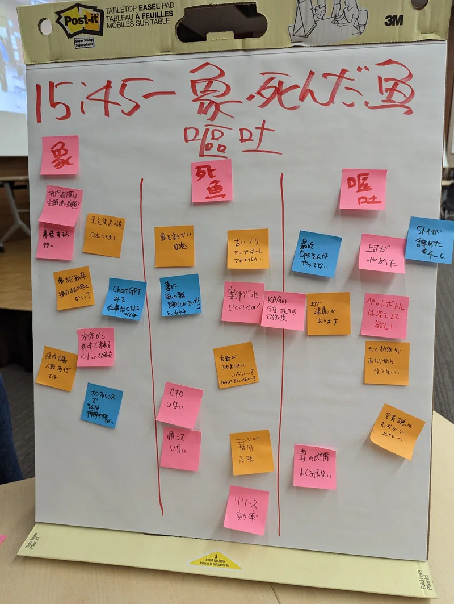

<!-- _class: top -->

## 20XX.X.X

# タイトル

### 部署名　氏名

---

# 見出し 1

- キッチンが進んでいく
- じゃがいもを目指す
- 玉ねぎが目に染みる
- キャベツはどうした？

---

# 見出し 1

## h2 の文章がここにくる

### h3 のフォントサイズは敢えて同じにしています

- 箇条書き
  - 箇条書きの小さいやつ

---

# ぴよ 
 「こんなのできないですよ」

# 
 「なんとかしろ」
 PO

---

<!-- _class: crosshead -->

# 大切なものは大切だとわかった

---

# 左に画像がある

---

# 右に画像がある

---

# 🐤
 こんにちは！これは吹き出しです。

# 
 こんにちは！これは吹き出しです。
 

---

<!-- _class: crosshead -->

# 中タイトル

---

# スクラムガイドには書いてある

> 確約、集中、公開、尊敬、勇気
> スクラムガイドより

---

<!-- _class: end -->
